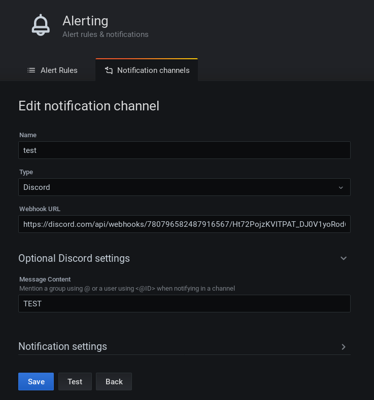
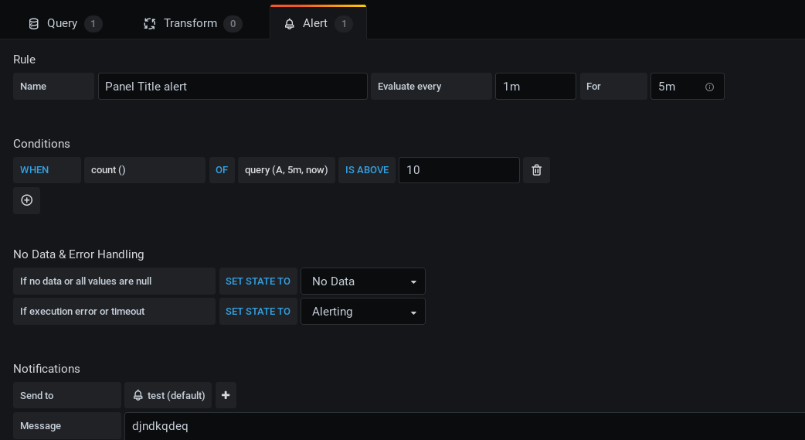
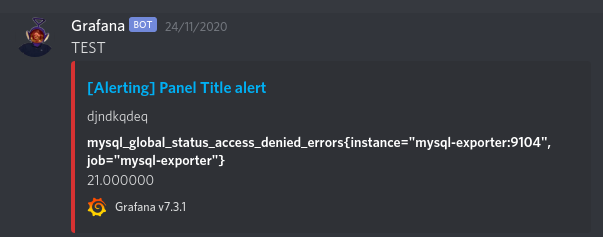
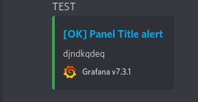

# TP10

Pour ce TP nous allons mettre en place un système de notification.
J'ai décidé de recevoir mes notifications sur Discord grâce aux *Webhooks*.

Après avoir créée un Webhooks sur un serveur Discord, nous pouvons l'utiliser dans Grafana.

## Création du channel de notifications

Ici on donne un nom à notre channel et selon le type (ici Discord), on nous demandera le lien du wbehook créée.

Il est également possible de remplir un message qui sera écris tel un texte au-dessus de la notification sur Discord.

## Configuration de la notification

Ici on configure une notification sur la query que contient le graphique.

La notificaition prendra compte de la condition qu'on lui donne, ici on vérifie le nombre de connexions refusées toutes les 5 minutes.
Si l'on en compte plus de 10, on envoie la notification.

Dans ce cas on *Send To* notre channel de notification créée plus tôt avec le message que contiendra la notification.

## Résultat

C'est alors que sur le serveur Discord, on reçoit ces petites notifications.

En faisant des tests, j'ai remarqué qu'après avoir reçu une notification sur Discord, car la condition était remplie. Si l'on modifie la valeur de note condition à ne pas dépasser. Par exemple passer de 10 à 40 et que cette nouvelle condition n'est pas remplie, on reçoit une nouvelle notification Discord

