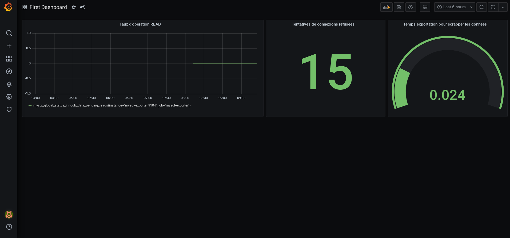
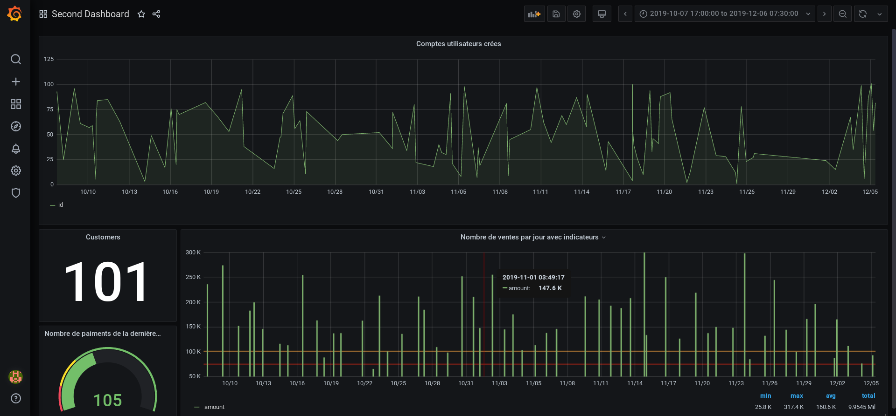
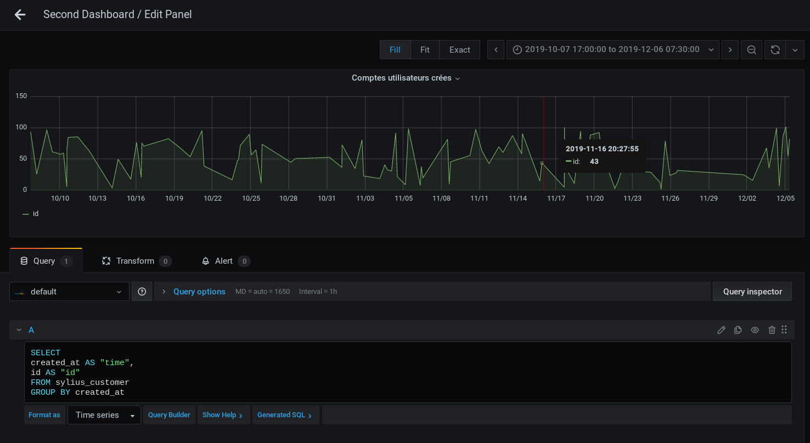
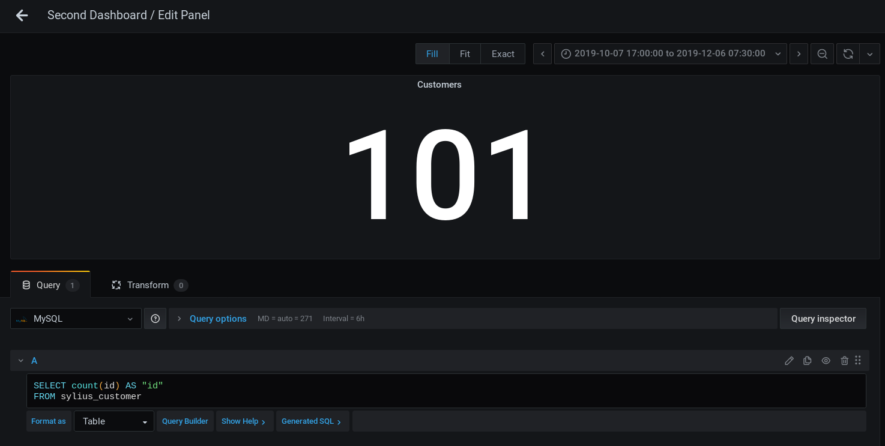
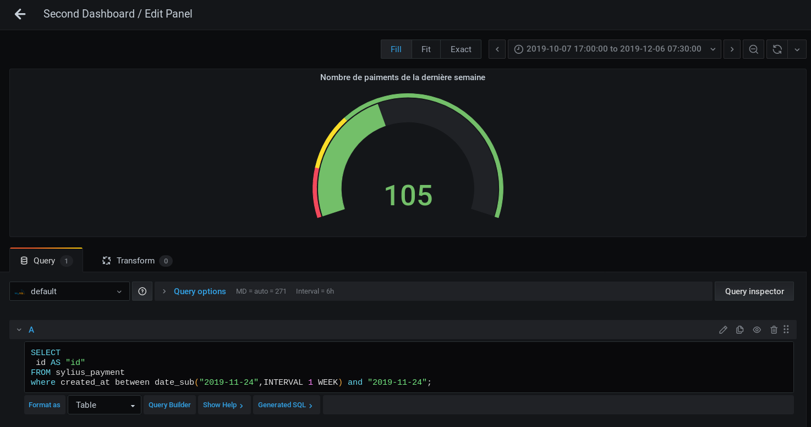
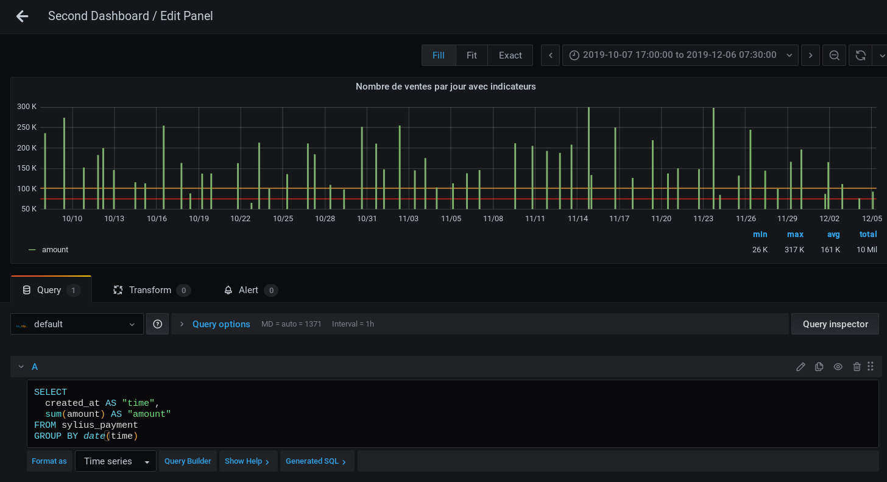

# TP9

En reprenant le [docker-compose](docker-compose.yaml) du TP précédent, on doit rajouter le service grafana auquel on connectera notre Prometheus et MySQL (mariadb).

Une fois les containers lancés : `docker-compose up -d`

On peut se rendre à l'url `localhost:3000` et arriver sur la page Grafana sur laquelle on se connecte avec `admin` et `admin` comme identifiants.

Avant de commencer il faut ajouter nos datasources ([formulaire prometheus](screenshots/prometheus_datasource.png) / [formulaire mysql](screenshots/mysql_datasource.png))

Tout est prêt pour récupérer les données !

## Premier dashboard

Rendu du premier dashboard :

Chaque panel dispose de sa metric. Dans l'édition de chacun, on retrouvera la[metric des READS](screenshots/read_metric.png), la [metric des erreurs de connexions](screenshots/errors_metric.png) ainsi que la [metric du temps d'exportation](screenshots/export_metric.png).

## Second dashboard

Rendu du second dashboard :

Comme précédemment, chaque panel dispose eux, de leur propre requête SQL.

Nous retrouvons donc la requête du nombre d'utilisateurs créés par jour :

Le nombre total de clients :

Le nombre de paiments de la dernière semaine :

Le volume de ventes par jour et ses indicateurs :
