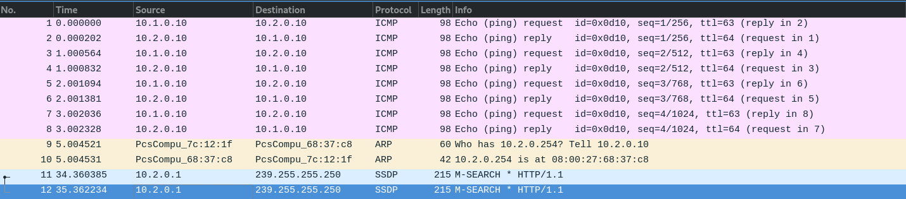

# PROJET RESEAU - TP4
## SPELEOLOGIE RESEAU : DESCENTE DANS LES COUCHES

### I. Mise en place du lab
#### 1. Création des réseaux
Pour créer de nouveaux réseaux host-only, je suis allé dans le menu "Gestionnaire de réseau hôte" dans VirtualBox. Ainsi j'ai pu créer un premier réseau portant l'IP `net1 : 10.1.0.1` et le second avec `net2 : 10.2.0.1`

#### 2. Créations des VMs
J'ai cloné ma VM patron pour en faire 3 : Client, Server, Router.
Pour leur faire porter les adresses IP demandées, je dois tout d'abord accèder au dossier network-scripts : `$ cd /etc/sysconfig/network-scripts/`.
Ainsi je peux ouvrir le fichier correspondant à la carte réseau : `$ sudo nano ifcfg-enp0s3` et modifier le contenu, notamment l'adresse IP en ajoutant la ligne `IPADDR=ip demandée`.

#### 3. Mise en place du routage statique   
Après avoir activé l'IPv4 Forwarding, je peux voir s'il y a des routes pour aller vers net1 et net2 :
> Sur routeur
```
$ ip route show
10.1.0.0/24 dev enp0s3 proto kernel scope link src 10.1.0.254 metric 100 
10.2.0.0/24 dev enp0s8 proto kernel scope link src 10.2.0.254 metric 101 
```
> Sur client

Je dois ajouter une route statique pour que le client puisse avoir une route vers `net1` et `net2`
```
net1
$ ip route add 10.1.0.0/24 via 10.1.0.254 dev enp0s3
$ ip route show
10.1.0.0/24 dev enp0s3 proto kernel scope link src 10.1.0.10 metric 100

net2
$ ip route add 10.2.0.0/24 via 10.1.0.254 dev enp0s3
$ ip route show
10.2.0.0/24 via 10.1.0.254 dev enp0s3
```
> Sur serveur
```
net1
$ ip route add 10.1.0.0/24 via 10.2.0.254 dev enp0s3
$ ip r s
10.1.0.0/24 via 10.2.0.254 dev enp0s3 

net2
$ ip route add 10.2.0.0/24 via 10.1.0.254 dev enp0s3
$ ip s r
10.2.0.0/24 dev enp0s3 proto kernel scope link src 10.2.0.10 metric 100
```

> Test
Client ping Server
```
$ ping 10.2.0.10
PING 10.2.0.10 (10.2.0.10) 56(84) bytes of data.
64 bytes from 10.2.0.10: icmp_seq=1 ttl=63 time=1.47 ms
64 bytes from 10.2.0.10: icmp_seq=2 ttl=63 time=2.09 ms
...
```
>Server ping Client
```
$ ping 10.1.0.10
PING 10.1.0.10 (10.1.0.10) 56(84) bytes of data.
64 bytes from 10.1.0.10: icmp_seq=1 ttl=63 time=1.53 ms
64 bytes from 10.1.0.10: icmp_seq=2 ttl=63 time=1.83 ms
...
```

### 2. Spéléologie réseau
#### 1. ARP
##### A. Manip 1
1. Pour vider la table ARP de mes machines, j'utilise la commande : `$ sudo ip neigh flush all`
2. J'affiche ma table ARP sur Client :
```
$ ip neigh show
10.1.0.1 dev enp0s3 lladdr 0a:00:27:00:00:01 DELAY
```
Nous pouvons voir que l'on connait l'adresse MAC de notre carte réseau.

3. J'affiche ma table ARP sur Serveur :
```
$ ip neigh show
10.2.0.1 dev enp0s3 lladdr 0a:00:27:00:00:02 DELAY
```
Pareil que pour la machine Client. 

4. Je ping ma machine Server avec Client : `$ ping 10.2.0.10`
J'affiche de nouveau la table ARP de ma machine Client :
```
$ ip neigh show
10.1.0.1 dev enp0s3 lladdr 0a:00:27:00:00:01 REACHABLE
10.1.0.254 dev enp0s3 lladdr 08:00:27:1e:71:a1 REACHABLE
```
Ici on comprend que nous avons accès au gateway et donc connaissons son adresse MAC.

5. J'affiche de nouveau ma table ARP de ma machine Server :
```
$ ip neigh show
10.2.0.1 dev enp0s3 lladdr 0a:00:27:00:00:02 REACHABLE
10.2.0.254 dev enp0s3 lladdr 08:00:27:d7:a7:a0 STALE
```
Le ping est passé par la machine Router pour le communiqué à la machine Client.

##### B. Manip 2
1. Je revide les tables ARP de toutes mes machines : `$ sudo ip neigh flush all`
2. J'affiche la table ARP de ma machine Router :
```
$ sudo ip neigh show
10.2.0.1 dev enp0s8 lladdr 0a:00:27:00:00:02 REACHABLE
```
Le router communique par le réseau choisi.

3. Avec ma machine Client je ping ma machine Server :
```
$ ping 10.2.0.10
PING 10.2.0.10 (10.2.0.10) 56(84) bytes of data.
64 bytes from 10.2.0.10: icmp_seq=1 ttl=63 time=2.59 ms
64 bytes from 10.2.0.10: icmp_seq=2 ttl=63 time=1.89 ms
...
```
4. J'affiche de nouveau la table ARP de ma machine Router :
```
$ ip neigh show
10.2.0.10 dev enp0s8 lladdr 08:00:27:1e:71:a1 REACHABLE
10.1.0.10 dev enp0s3 lladdr 08:00:27:1e:71:a1 REACHABLE
10.2.0.1 dev enp0s8 lladdr 0a:00:27:00:00:02 DELAY
```
Le router reconnait et ajoute la machine Server sur son réseau.

##### C. Manip 3
1. Je vide de nouveau les tables ARP de toutes mes machines : `$ sudo ip neigh flush all`
2. J'affiche la table ARP de mon pc : `$ ip neigh show`
Maintenant je l'efface : `$ sudo ip neigh flush all`
Quand je l'affiche de nouveau :
```
$ ip neigh show
192.168.1.55 dev wlp58s0 lladdr e0:51:63:c1:4f:16 REACHABLE
```
Après avoir attendu :
```
192.168.1.55 dev wlp58s0 lladdr e0:51:63:c1:4f:16 REACHABLE
192.168.1.254 dev wlp58s0 lladdr 6c:38:a1:24:6a:94 REACHABLE
```

##### D. Manip 4
1. Je commence par vider les tables ARP de toutes mes machines : `$ sudo neigh flush all`
2. J'affiche la table ARP de ma machine Client :
```
$ ip n s
10.1.0.1 dev enp0s3 lladdr 0a:00:27:00:00:01 REACHABLE
```
3. J'active ensuite la carte NAT `$ ip ifup enp0s3`
4. Ensuite je tente de curl vers google :
```
$ curl google.com
<HTML><HEAD><meta http-equiv="content-type" content="text/html;charset=utf-8">
<TITLE>301 Moved</TITLE></HEAD><BODY>
<H1>301 Moved</H1>
The document has moved
<A HREF="http://www.google.com/">here</A>.
</BODY></HTML>
```
5. Et donc quand j'affiche de nouveau la table ARP, une nouvelle ligne est ajoutée :
```
10.0.2.2 dev enp0s8 lladdr 52:54:00:12:35:02 REACHABLE
10.1.0.1 dev enp0s3 lladdr 0a:00:27:00:00:0e REACHABLE
```

#### 2. Wireshark
##### A. Interception ARP et ping
1. Tout d'abord je lance Wireshark sur ma machine Router pour intercepter le trafic qui passe par l'interface que j'ai choisie et l'enregistre dans un fichier ping.pcap : `$ sudo tcpdump -i enp0s3 -w ping.pcap`
2. Ensuite je vide la table ARP de ma machine Client puis j'envoie 4 ping à ma machine Server : 
```
$ sudo ip neigh flush all
$ ping -c 4 10.2.0.10
PING 10.2.0.10 (10.2.0.10) 56(84) bytes of data.
64 bytes from 10.2.0.10: icmp_seq=1 ttl=63 time=2.32 ms
64 bytes from 10.2.0.10: icmp_seq=2 ttl=63 time=2.33 ms
64 bytes from 10.2.0.10: icmp_seq=3 ttl=63 time=2.08 ms
64 bytes from 10.2.0.10: icmp_seq=4 ttl=63 time=2.02 ms

--- 10.2.0.10 ping statistics ---
4 packets transmitted, 4 received, 0% packet loss, time 3006ms
rtt min/avg/max/mdev = 2.022/2.191/2.335/0.151 ms
```
3. Sur ma machine Server, je quitte la capture Wireshark avec un `Ctrl-c`, puis je vérifie la présence du fichier avec `ls`.

```
tcpdump: listening on enp0s3, link-type EN10MB (Ethernet), capture size 262144 bytes
^C22 packets captured
24 packets received by filter
0 packets dropped by kernel
$ ls
ping.pcap
```
Enfin, je l'envoie sur mon PC hôte :
```
$ sudo scp admin@10.2.0.254:/home/admin/ping.pcap ~/Bureau
admin@10.2.0.254's password: 
ping.pcap             100%   46KB  11.0MB/s   00:00  
```



##### B. Interception d'une communication netcat
Premièrement, je vide les tables ARP de toutes mes machines :  `sudo ip neigh flush all`
Maintenant, je lance Wireshark sur ma machine Router pour intercepter le trafic qui passe par l'interface que j'ai choisie et l'enregistre dans un fichier netcat_ok.pcap : `$ sudo tcpdump -i enp0s3 -w netcat_ok.pcap`
Après avoir ouvert le port `1222` sur ma machine Server, j'ouvre un serveur netcat dessus : `nc -lp 1222`
Et je peux m'y connecter avec ma machine Client :
```
$ nc 10.2.0.10 1222
je suis la machine client
je suis la machine server
message quelconque
ah oui t'as pas trop d'inspi toi
dsl :/
```
Enfin, depuis ma machine Router, j'envoie le fichier netcat_ok.pcap sur mon PC hôte :
```
$ sudo scp admin@10.2.0.254:/home/admin/netcat_ok.pcap ~/Bureau
admin@10.2.0.254's password: 
netcat_ok.pcap             100%   12KB  30.0MB/s   00:00  
```
