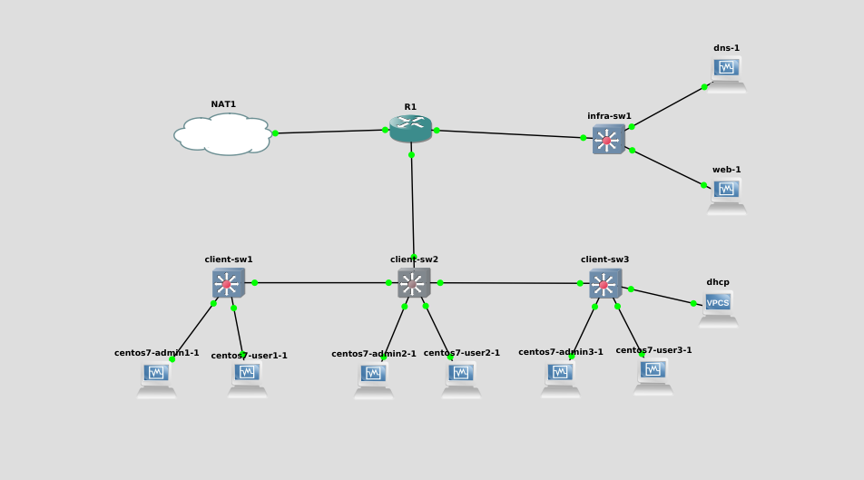
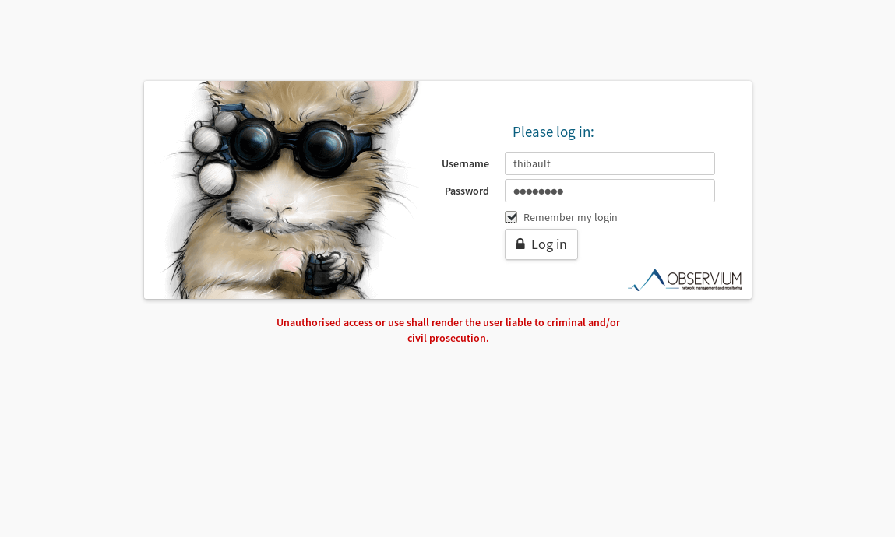

# TP4 : Buffet à volonté

## Membres du projet

- FEUGERE Thibault
- LARRIEU Maxime

## La topo de base
### Configuration actuelle (21/04/2020)

[Configuration R1](router.txt)

[Configuration client-sw-1](client-sw1.txt)

[Configuration client-sw-2](client-sw2.txt)

[Configuration client-sw-3](client-sw3.txt)

Voilà à quoi ressemble notre topologie :

<div align="center"></div>

## Installation de HTTPD sur Centos 7

`sudo yum install httpd`

Ensuite, on démarre le serveur avec la commande : `sudo systemctl start httpd`.

Pour finir, on fait en sorte qu'à chaque reboot de la machine, le serveur démarre aussi avec la commande : `sudo systemctl enable httpd`.

On démarre le serveur DHCP avec la commande : `sudo systemctl start dhcpd`.

On ajoute le service au démarrage avec la commande : `sudo systemctl enable dhcpd`.

## Installation d'un serveur DHCP sur Centos 7

Pour installer un serveur DHCP on utilise la commande : `sudo yum install dhcp`.

La configuration du serveur DHCP se passe dans : `/etc/dhcp/dhcpd.conf`

## Observium

On a choisit de découvrir Observium car ca a l'air stylé et nous avons un peu travaillé sur Grafana ces derniers temps car la data viz nous intéresse.

### Qu'est-ce qu'Observium ?

C'est un outil de moniroting (d'ou le côté Data Visualisation). L'outil utilise le protocole SNMP (Simple Network Management Protocol). Les points sympathiques sont que c'est gratuit et open source, et ça, on aime. Aussi, c'est relativement facile à mettre en place.

### Qu'est-ce que SMNP

SMNP est un protocole qui permet de superviser, gérer et contrôler les équipements du réseaux à distance.

### Installer Observium sur Centos 7

#### On ajoute les repos : REMI, OpenNMS et EPEL

```
yum install https://dl.fedoraproject.org/pub/epel/epel-release-latest-7.noarch.rpm
yum install http://yum.opennms.org/repofiles/opennms-repo-stable-rhel7.noarch.rpm
yum install http://rpms.remirepo.net/enterprise/remi-release-7.rpm
```

#### Installation de yum-utils

`yum install yum-utils`

#### Activer PHP 7.2

`yum-config-manager --enable remi-php72`

#### On met à jour les packages

`yum update`

#### Packages nécessaires pour Observium

```
yum install wget.x86_64 httpd.x86_64 php.x86_64 php-opcache.x86_64 php-mysql.x86_64 php-gd.x86_64 \
            php-posix php-pear.noarch cronie.x86_64 net-snmp.x86_64 net-snmp-utils.x86_64 \
            fping.x86_64 mariadb-server.x86_64 mariadb.x86_64 MySQL-python.x86_64 rrdtool.x86_64 \
            subversion.x86_64  jwhois.x86_64 ipmitool.x86_64 graphviz.x86_64 ImageMagick.x86_64 \
            php-sodium.x86_64
```

#### Création du dossier Observium

`mkdir -p /opt/observium && cd /opt`

#### Téléchargement et extraction de Observium Community Edition

`wget http://www.observium.org/observium-community-latest.tar.gz`

puis

`tar zxvf observium-community-latest.tar.gz`

#### Mariadb (car c'est Open Source)

On active mariadb au démarrage, et on le démarre.

```
systemctl enable mariadb
systemctl start mariadb
```

#### Création de la base de donnée

```
sudo mysql
mysql> CREATE DATABASE observium DEFAULT CHARACTER SET utf8 COLLATE utf8_general_ci;
```

#### Création de l'utilisateur observium

```
mysql> GRANT ALL PRIVILEGES ON observium.* TO 'observium'@'localhost' IDENTIFIED BY 'observium';
mysql> exit;
```

#### Copie du fichier de configuration

```
cd observium
cp config.php.default config.php
```

#### Configuration du fichier de configuration (c'est bizarre dit comme ça)

##### Avant

```
// Database config ---  This MUST be configured
$config['db_extension'] = 'mysqli';
$config['db_host']      = 'localhost';
$config['db_user']      = 'USERNAME';
$config['db_pass']      = 'PASSWORD';
$config['db_name']      = 'observium';
```

##### Après

```
// Database config ---  This MUST be configured
$config['db_extension'] = 'mysqli';
$config['db_host']      = 'localhost';
$config['db_user']      = 'observium';
$config['db_pass']      = 'observium';
$config['db_name']      = 'observium';

$config['fping'] = "/usr/sbin/fping";
```

#### Insertion du schéma SQL

`./discovery.php -u`

#### Désactiver SE Linux

##### Temporairement

`setenforce 0`

##### Permanent

`SELINUX=permissive`

#### Création de /etc/httpd/conf.d/observium.conf

```
<VirtualHost *>
   DocumentRoot /opt/observium/html/
   ServerName  observium.domain.com
   CustomLog /opt/observium/logs/access_log combined
   ErrorLog /opt/observium/logs/error_log
   <Directory "/opt/observium/html/">
     AllowOverride All
     Options FollowSymLinks MultiViews
     Require all granted
   </Directory>
</VirtualHost>
```

#### Création du dossier de logs

```
mkdir /opt/observium/logs
chown apache:apache /opt/observium/logs
```

#### On ajoute un utilisateur

```
cd /opt/observium
./adduser.php thibault thibault 10
```

#### Commandes initiales

```
./discovery.php -h all
./poller.php -h all
```

#### Cron jobs

```
sudo vim /etc/cron.d/observium

# Run a complete discovery of all devices once every 6 hours
33  */6   * * *   root    /opt/observium/discovery.php -h all >> /dev/null 2>&1

# Run automated discovery of newly added devices every 5 minutes
*/5 *     * * *   root    /opt/observium/discovery.php -h new >> /dev/null 2>&1

# Run multithreaded poller wrapper every 5 minutes
*/5 *     * * *   root    /opt/observium/poller-wrapper.py >> /dev/null 2>&1

# Run housekeeping script daily for syslog, eventlog and alert log
13 5 * * * root /opt/observium/housekeeping.php -ysel

# Run housekeeping script daily for rrds, ports, orphaned entries in the database and performance data
47 4 * * * root /opt/observium/housekeeping.php -yrptb
```

On redemarre le processus Cron

`systemctl reload crond`

#### On active Apache (HTTPD) au démarrage et on le démarre

```
systemctl enable httpd
systemctl start httpd
```

#### On autorise le protocole HTTP par le Firewall

```
firewall-cmd --permanent --zone=public --add-service=http
firewall-cmd --reload
```

### Yeah !

<div align="center"></div>
