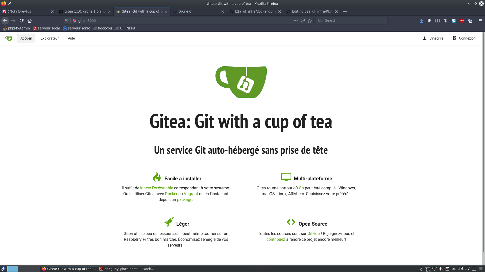
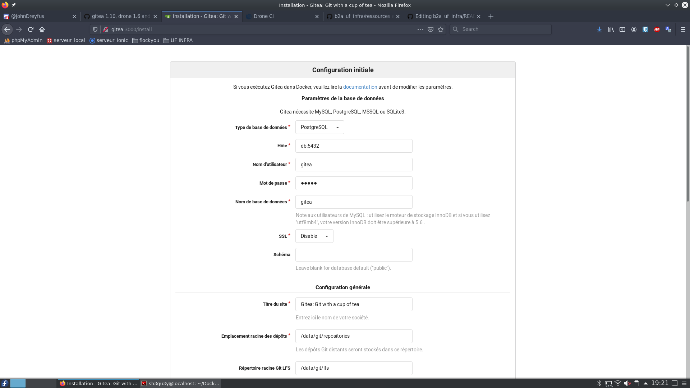
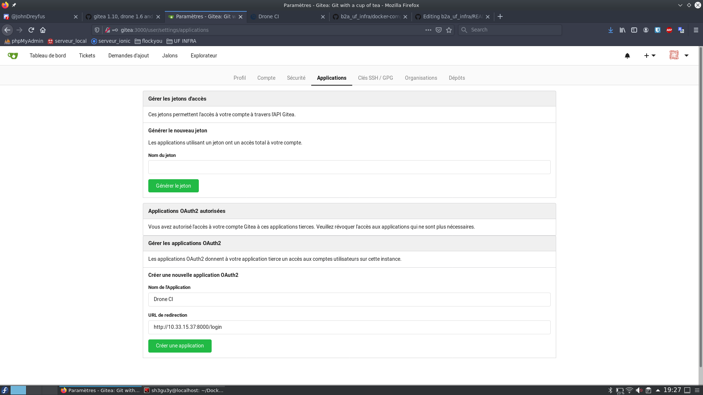
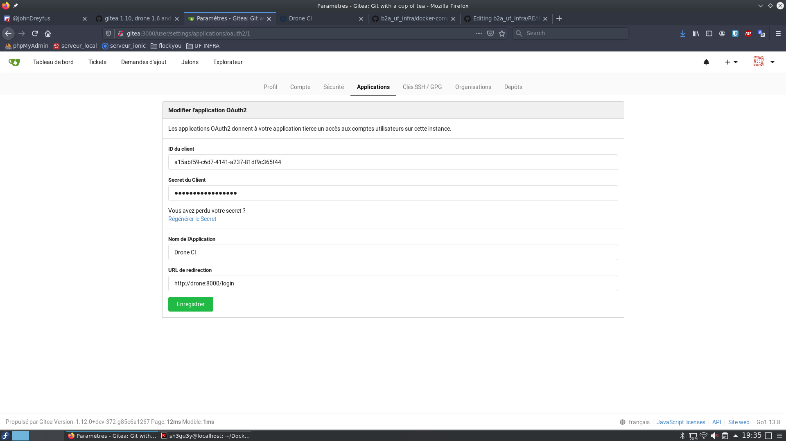
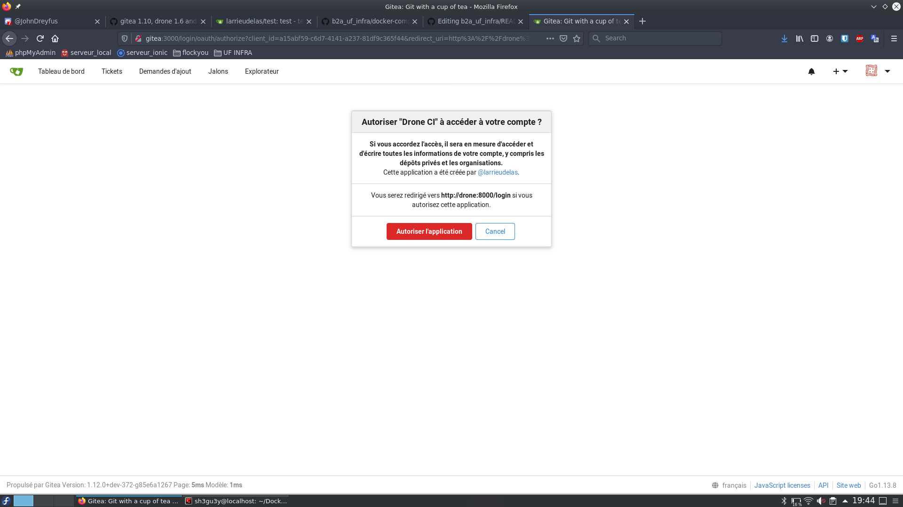
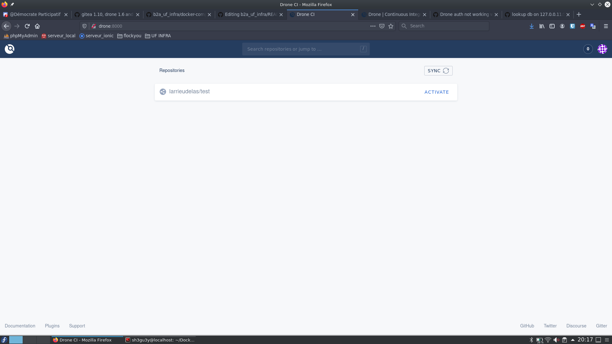

# b2a_uf_infra

## Protocole de déploiement

### Cloner le répertoire

Toutes les ressources nécessaires au déploiement du projet se trouve dans le repo. Vous pouvez donc simplement executer la commande : `git clone https://github.com/maximelarrieu/b2a_uf_infra`.

### Fichiers docker-compose

Deux fichier de configuration de docker sont à votre disposition.

[docker-compose.yml](/docker-compose.yml) est à configurer selon où vous voulez déployer le projet. En local ou sur votre propre serveur privé. Les informations à modifier se trouvent entre <Informations à modifier>

[docker-compose-example.yml](/docker-compose-example.yml) est le fichier déjà configuré que nous utilisons pour déployer le projet sur notre serveur privé Ynov.

Ces deux fichiers permettent de créer et de déployer les conteneurs nécessaires au projet.

### Création et déploiement des conteneurs

Une fois le `docker-compose.yml` configuré, vous pouvez l'exécuter.

```
$ sudo docker-compose up -d
Creating network "b2a_uf_infra_gitea" with the default driver
Creating network "b2a_uf_infra_default" with the default driver
Creating volume "b2a_uf_infra_gitea-app" with default driver
Creating volume "b2a_uf_infra_gitea-db" with default driver
Pulling gitea-db (postgres:9.6)...
9.6: Pulling from library/postgres
619014d83c02: Pull complete
7ec0fe6664f6: Pull complete
...
b16493153120: Pull complete
690cca3ebd5e: Pull complete
Digest: sha256:c404895297aeb6ee6a9fbab874c534b0d20891207ed4d635a68076ce6d64425a
Status: Downloaded newer image for postgres:9.6
Pulling gitea-gui (gitea/gitea:latest)...
latest: Pulling from gitea/gitea
c9b1b535fdd9: Pull complete
b23cc1e06fde: Pull complete
...
0661aaf8b4a0: Pull complete
Digest: sha256:1c12a2146cf991eba3538c7e01165558823db83a0472a85b5377ea38456cfbaa
Status: Downloaded newer image for gitea/gitea:latest
Creating b2a_uf_infra_gitea-db_1 ... done
Creating b2a_uf_infra_gitea-gui_1 ... done
Creating b2a_uf_infra_drone-gui_1 ... done
Creating b2a_uf_infra_drone-runner-docker_1 ... done
```

L'execution récupère dans un premier temps les images demandées par les conteneurs, puis les conteneurs sont créées. Nous pouvons les voir en executant :

```
$ sudo docker ps -a
CONTAINER ID        IMAGE                              COMMAND                  CREATED             STATUS              PORTS                                         NAMES
c5c714dd2567        drone/drone-runner-docker:latest   "/bin/drone-runner-d…"   4 minutes ago       Up 4 minutes        3000/tcp                                      b2a_uf_infra_drone-runner-docker_1
fd2ea7062bb7        drone/drone:1.6.2                  "/bin/drone-server"      4 minutes ago       Up 4 minutes        80/tcp, 443/tcp, 0.0.0.0:8000->8000/tcp       b2a_uf_infra_drone-gui_1
4ce3ee660303        gitea/gitea:latest                 "/usr/bin/entrypoint…"   4 minutes ago       Up 4 minutes        0.0.0.0:3000->3000/tcp, 0.0.0.0:222->22/tcp   b2a_uf_infra_gitea-gui_1
4187d26d7996        postgres:9.6                       "docker-entrypoint.s…"   4 minutes ago       Up 4 minutes        5432/tcp                                      b2a_uf_infra_gitea-db_1
```

### Accès à l'interface Gitea

Selon la configuration donnée dans les conteneurs, vous pouvez accèder tout d'abord à l'interface Gitea en passant par l'URL fournie à la ligne `ROOT_URL=`. Dans notre cas, il est possible d'y accèder via `http://10.33.15.37:3000`.

_Page d'accueil_


Par la suite, en accèdant à `S'inscrire` (ou n'importe quel autre menu), vous obtiendrez une page de configuration de Gitea.

_Page de configuration de Gitea_


Les champs sont déjà pré-remplis grâce aux informations fournies dans le fichier [docker-compose.yml](/docker-compose-example.yml).
Il suffit alors de valider le formulaire `Installer Gitea`.

### Création du compte Gitea et mise en place de l'application OAuth2 Drone

Une fois l'installation terminée. Il ne vous reste plus qu'à créer un compte Gitea.

Depuis votre interface Gitea, cliquez sur votre profil et sélectionnez `Application`.
Rendez-vous au dernier formulaire proposé où vous pourrez commencer à configurer Drone.

_Formulaire OAuth2 Application_


Tout d'abord, donnez un nom à votre application. Puis dans le l'URL de redirection, réutiliser l'URL configuré dans le fichier [docker-compose.yml](/docker-compose-example.yml) avec cette fois-ci comme port `:8000` ainsi que `/login`. Cette route, permettra, une fois le lien fait entre nom compte Gitea et Drone, vous serez redirigez vers cette URL.

A la validation du formulaire, vous obtiendez des informations complémentaires.

_Formulaire des identifiants pour Drone_


Il vous faudra coller le champs `ID du client` que vous collerez à la ligne `DRONE_GITEA_CLIENT_ID=`.
Faire de même avec le champs `Secret du client` que vous collez à la ligne `DRONE_GITEA_CLIENT_SECRET`. Fait ? Il ne vous reste plus qu'à `Enregistrer` le formulaire.

### Accès à l'interface Drone

Premièrement, il faut d'abord relancer le fichier [docker-compose.yml](/docker-compose-example.yml).

```
$ sudo docker-compose up -d
b2a_uf_infra_gitea-db_1 is up-to-date
b2a_uf_infra_gitea-gui_1 is up-to-date
Recreating b2a_uf_infra_drone-gui_1 ... done
Recreating b2a_uf_infra_drone-runner-docker_1 ... done
```

On peut voir que seulement les conteneurs Drone se mettent à jour. Ils récupèrent les informations concernant le compte Gitea auquel se lier.

Pour obtenir un aperçu un peu plus parlant, je vous invite à créer un repository 'test' dans Gitea.

Désormais, vous pouvez accèder à votre interface Drone en remplaçant le port `3000` utilisé par Gitea, par le port `8000` qu'utilise donc.. Drone.

_Page d'accès à Drone_


Sur cette nouvelle page, si les identifiants renseignés au prélable sont bons, vous pourrez voir `Cette application a été créée par @votregiteauser.` ainsi que la redirection, elle aussi renseignée au moment de la création de l'application OAuth2.

Après avoir `Accepter l'application`, vous accèderez à l'interface Drone.

_Interface Drone_


Vous retrouverez le repository créée plus tôt, repo que vous pouvez d'ores et déjà l'activer.

### Configuration d'une pipeline Drone

Je vous invite désormais à créer un fichier à la racine de votre repository, que vous nommerez [.drone.yml](/.drone.yml).

Au push, Drone détectera le fichier `.drone.yml` et exécutera les tests donnés dans la section `commands`. Selon, si le(s) test(s) passe(nt), Drone renverra un `Success` ou à contrario une `Error`.

##### Liens ressources

https://angristan.xyz/2018/08/host-your-own-ci-cd-server-with-drone/https://raspberry-pi.fr/mettre-en-ligne-serveur-web-raspbian-dydns-port-forwarding/
https://gist.github.com/tobydeh/e85532b358d01b45789e1c3b119620ef
https://medium.com/faun/setup-a-drone-cicd-environment-on-docker-with-letsencrypt-69b259d398fb

---

## Théo

### Sécuriser l'accès SSH : **SERVEUR DEBIAN**

https://korben.info/tuto-ssh-securiser.html

-   Copier le fichier de configuration SSH (au cas ou hein)

    ```
    $ cd /etc/ssh
    $ sudo cp sshd_config sshd_config.orig
    ```

-   Dans le fichier de config `/etc/ssh/sshd_config`

    -   Modifier le port d'ecoute de SSH _(22 par défaut)_ :  
        Port SSH passé sur le port **2222**

    -   Établir un temps pour se connecter :  
        `LoginGraceTime 30` (30sec pour se connecter avant fermeture du SSH)

    -   Redemarrer le service SSH
        ```
        sudo /etc/init.d/ssh restart
        ```

---

-   Authentification par clés SSH

    -   Sur **SERVEUR** :

        -   Créer le répertoire `.ssh` dans note `HOME` qui accueillera un fichier contenant les clés SSH

            ```
            mkdir ~/.ssh
            ```

        -   Changer les droits d'accès de ce répertoire
            ```
            chmod 0700 ~/.ssh
            ```
            Ceci permet au propriétaire du fichier de tout faire (7), et restreint les droits aux autres


    -   Sur **HOST** :

        -   Créer une paire de clés publique et privé sur le host

            ```
            ssh-keygen -t rsa -b 2048 -C "Un commentaire pour vous aider à identifier votre clé"
            ```

        -   Copier la clé publique sur le serveur
            ```
            cd ~/.ssh
            scp id_rsa.pub user@10.33.15.37:~/.ssh/authorized_keys
            ```

        - On rechange les droits sur le répertoire qui contient les clés
            ```
            chmod 0600 ~/.ssh/*
    	    ```
            Permet au propriétaire de lire et écrire, mais pas d'executer

        -   Dans le fichier `/etc/ssh/sshd_config` :
            - Indiquer au serveur SSH où se trouvent les clés et lui dire qu'on va les utiliser comme méthode d'authentification
                ```
                PubkeyAuthentication yes
                AuthorizedKeysFile .ssh/authorized_keys
                ```
            - Désactiver toutes les autres méthodes d'authentification
                ```
                UsePAM no
                KerberosAuthentication no
                GSSAPIAuthentication no
                PasswordAuthentication no
                ```
        -   Redemarrer le service SSH
            ```
            sudo /etc/init.d/ssh restart
            ```


    On est maintenant obligé de se connecter au serveur avec nos clés privé, sinon l'accès est refusé

## Fail2ban

_Permet de bannir une IP qui echoue en boucle à se connecter au serveur en ssh, à un site ..._

-   Installer fail2ban :
    ```
    sudo apt-get install fail2ban
    ```
-   Modifier le fichier de configuration pour surcharger la configuration de fail2ban cntenu dans le fichier `jail.conf`:

    ```
    sudo nano /etc/fail2ban/jail.d/defaults-debian.conf
    ```

    ```
    [DEFAULT] (section pour tous les plugins)
    ignoreip = 127.0.0.1/8 XX.XX.XX.XX (son IP pour ne pas se faire bannir)

    [sshd]
    enabled = true
    port = ssh #(le port ssh)
    maxrtry = 5 #(nombre de tentatives avant le bannissement)
    bantime = 600 #(temps de banissement en secondes)
    findtime = 600 #(interval durant lequel "maxretry" sera pris en compte avant de se faire bannir son IP)
    logpath = /var/log/auth.log #(fichier que fail2ban va regarder pour vérifier les connexions et surtout les echecs)

    ```

-   Relancer le serveur fail2ban

    ```
    sudo systemctl restart fail2ban
    ```

-   Vérifier les jails lancées
    ```
    sudo fail2ban-client status
    ```
-   Vérifier les IPs ban
    ```
    sudo fail2ban-client sshd
    ```

#### Conguration initiale mise en place sur une Raspberry dans un réseau privé.

## Sécuriser l'accès SSH : **RASPBERRY**

https://community.gladysassistant.com/t/tutoriel-securiser-lacces-ssh-sur-votre-raspberry/2157

-   Demander le mot de passe pour l'utilisation de `sudo`

    ```
    $ cd /etc/sudoers.d
    $ sudo mv 010_pi-nopasswd 010_pi-passwd
    $ sudo vi 010_pi-passwd
    ```

    Modifier la ligne :

    ```
    pi ALL=(ALL) NOPASSWD: ALL
    ```

    En :

    ```
    pi ALL=(ALL) PASSWD: ALL
    ```

-   Copier le fichier de configuration SSH (au cas ou hein)

    ```
    $ cd /etc/ssh
    $ sudo cp sshd_config sshd_config.orig
    ```

-   Dans le fichier de config `/etc/ssh/sshd_config`

    -   Modifier le port d'ecoute de SSH _(22 par défaut)_ :  
        Port SSH passé sur le port **2222**

    -   Établir un temps pour se connecter :  
        `LoginGraceTime 30` (30sec pour se connecter avant fermeture du SSH)

    -   Nombre de tentative de mot de passe avant fermeture SSH :  
        `MaxAuthTries 1` (1 erreur et SSH fermé)

    -   Temps d'inactivité avant déconnexion :  
        `ClientAliveInterval 900` (15min d'inactivité et SSH raccroche)

    -   Redemarrer le service SSH
        ```
        sudo systemctl restart ssh
        ```

---

-   Authentification par clés SSH

    -   Sur **HOST** :

        -   Créer une paire de clés publique et privé sur le host

            ```
            ssh-keygen -t rsa -b 2048 -C "Un commentaire pour vous aider à identifier votre clé"
            ```

        -   Copier la clé publique sur la raspberry
            ```
            cd ~/.ssh
            scp id_rsa.pub pi@my_raspberry_ip:~/.ssh/authorized_keys
            ```
        -   Possibilité de se connecter a la raspberry en utilisant sa clé privé
            ```
            ssh pi@my_raspberry_ip -p <ssh_port> -i ~/.ssh/id_rsa
            ```

    -   Sur **RASPBERRY** :
        -   Dans le fichier `/etc/ssh/sshd_config`
            ```
            PasswordAuthentication no
            ChallengeResponseAuthentication no # this should be the default anyway
            UsePAM no
            ```
        -   Redemarrer le service SSH
            ```
            sudo service ssh restart
            ```

    On est maintenant obligé de se connecter au serveur avec nos clés privé, sinon l'accès est refusé

---

## Maxime

### I- Connexion à la raspberry à distance

#### Local

Pour connecter ma raspberry à mon réseau personnel, il faut tout d'abord éditer le fichier [wpa_supplicant.conf](connexion_raspberry/wap_supplicant.conf) avec les informations relatives à mon réseau.

Maintenant qu'elle est connectée, nous pouvons repérer son adresse IP avec `ifconfig` ou sur le panel d'administration de mon opérateur.
Selon l'opérateur, l'interface est différent (et potentiellement les menus), mais le protocole est identique. Dans le un menu faisant référence au `NAT/PAT`, nous allons pouvoir ouvrir des ports à notre raspberry.

Nous définissons à notre `Équipement` Raspberry un service `HTTP` avec un `Protocole` TCP sur le `Port` 80. Nous ferons de même avec un `Service` HTTPS sur le `Port` 80. Ainsi nous pouvons rediriger des requêtes web vers notre Raspberry.

Néanmoins, nous ne pouvons y accèder que dans le même réseau. Il faut mettre en place un `DynDNS`.

#### DynDNS

Ce service permet de donner à un DNS (associe une IP à une adresse URL) à une adresse dynamique.

Nous utiliserons ce service sur https://noip.com qui le fourni gratuitement. Après avoir créée un compte, nous pouvons choisir un nom de domaine, qui sera : https://myraspberry.sytes.net . Il faut maintenant retourner dans le panel d'administration de mon réseau pour reliée la box à ce compte.

Pour configurer la box, on se retrouve dans le menu `DynDNS` où il est possible d'y ajouter une règle. Dans laquelle nous définissons notre `Service` sur no-ip et fournissons le nom de domaine choisi et les informations relatives au compte demandées.

Après avoir redémarré la box, nous pouvons y accèder depuis l'extérieur du réseau !

### II- Mise en place de Git sur la Raspberry

La noyau de notre projet est évidemment le logiciel de versionning `git`. Il nous faut absolument l'installer sur la machine : `sudo apt install git`

### III- Configuration Gitea & Nginx

-   Création de l'user associé à Gitea :
    `sudo adduser --disabled-login --gecos 'Gitea' git`

-   Téléchargement et installation de Gitea :
    `wget -O gitea https://dl.gitea.io/gitea/1.4.0/gitea-1.10.0-linux-arm-6`

-   Le rendre executable :
    `chmod +x gitea`

-   Configuration du service Gitea :

    ```
    // /etc/systemd/system/gitea.service

    [Unit]
    Description=Gitea
    After=syslog.target
    After=network.target
    After=mariadb.service mysqld.service postgresql.service memcached.service redis.service

    [Service]
    # Modify these two values and uncomment them if you have
    # repos with lots of files and get an HTTP error 500 because
    # of that
    ###
    #LimitMEMLOCK=infinity
    #LimitNOFILE=65535
    Type=simple
    User=git
    Group=git
    WorkingDirectory=/home/git
    ExecStart=/home/git/gitea web
    Restart=always
    Environment=USER=git HOME=/home/git

    [Install]
    WantedBy=multi-user.target
    ```

-   Activation et lancement de Gitea :
    ```
    sudo systemctl enable gitea
    sudo systemctl start gitea
    ```
-   Installation de Nginx :
    `sudo apt-get install nginx -y`

-   Modifications du fichier de configuration :

    ```
    // /etc/nginx/sites-available/gitea

    server {
        listen 443 ssl;
        server_name rpi-git myraspberry.sytes.net;
        ssl_certificate     /etc/letsencrypt/live/myraspberry.sytes.net/fullchain.pem;
        ssl_certificate_key /etc/letsencrypt/live/myraspberry.sytes.net/privkey.pem;

        location / {
            client_max_body_size 364M;
            proxy_pass http://localhost:3000;
            proxy_connect_timeout 600;
            proxy_send_timeout 600;
            proxy_read_timeout 600;
            send_timeout 600;
            proxy_set_header X-Real-IP $remote_addr;
        }
    }

    server {
        listen 80;
        server_name rpi-git myraspberry.sytes.net;
        return 301 https://$host$request_uri;
    }
    ```

-   Activation de Gitea avec nginx :

    ```
    sudo ln -s /etc/nginx/sites-available/gitea /etc/nginx/sites-enabled/gitea
    sudo rm /etc/nginx/sites-enabled/default
    sudo service nginx restart
    ```

-   Téléchargement et activation du certificat SSL :

    ```
    wget https://dl.eff.org/certbot-auto
    chmod a+x certbot-auto
    sudo ./certbot-auto certonly --standalone -d myraspberry.sytes.net
    ```

-   Reload certificat SSL grâce à une tâche cron (crontab) :
    `0 1 2 * * sudo service nginx stop && sudo /home/pi/certbot-auto renew && sudo service nginx start`

-   Redémarrage Nginx pour appliquer les nouveaux paramètres :
    `sudo service nginx restart`

Nous obtenons maintenant la superbe interface tant attendue de Gitea !


Pour conclure, une dernière configuration est nécessaire. Configuration dans laquelle nous définirons la connexion à la base de données ainsi que notre nom de domaine en tant que chemin principal.

Nous retrouverons cette configuration dans le fichier `/home/git/custom/conf/`[app.ini](ressources/app.ini). Le fait d'effacer ce fichier nous permettra de reconfigurer notre serveur Gitea.

##### Liens ressources

https://pimylifeup.com/raspberry-pi-gitea/
https://raspberry-pi.fr/mettre-en-ligne-serveur-web-raspbian-dydns-port-forwarding/
https://www.sitepoint.com/setting-up-your-raspberry-pi-as-a-git-server/
